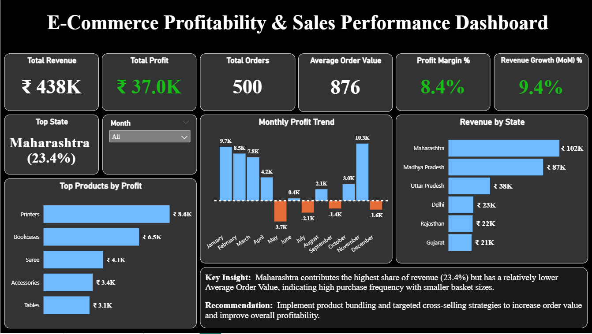
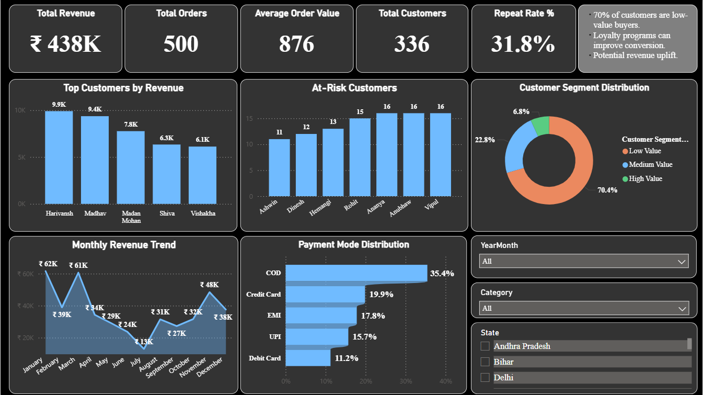
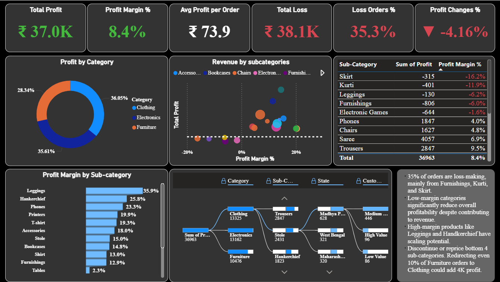

# E-Commerce Sales & Profitability Analysis

  A complete end-to-end data analysis project focused on improving **business performance, profitability, and decision-making** using **SQL, Python, and Power BI**.

---

##  Project Overview

This project analyzes an e-commerce dataset to uncover **actionable insights** that help businesses:

* Increase **profit margins**
* Identify **loss-making products and regions**
* Understand **customer behavior**
* Optimize **sales strategies**

The goal was to transform raw data into **strategic insights** that support data-driven decision-making.

---

##  Objectives

*  Evaluate overall business performance using KPIs
*  Identify loss-making products and categories
*  Analyze customer segmentation and revenue contribution
*  Understand seasonal sales patterns
*  Provide actionable business recommendations

---

##  Tools & Technologies

| Tool                       | Purpose                             |
| -------------------------- | ----------------------------------- |
| **SQL**                    | Data cleaning & preprocessing       |
| **Python (Pandas, NumPy)** | Data analysis & feature engineering |
| **Matplotlib & Seaborn**   | Data visualization                  |
| **Power BI**               | Interactive dashboard               |

---

## 📂 Project Structure

```
E-Commerce Profitability & Sales Performance Dashboard/
│
├── DATA/
│   └── Cleaned_Ecommerce_Data.csv
│
├── SQL/
│   └── Data_cleaning.sql
│
├── PythonNotebooks/
│   └── EDA_Ecommerce_Analysis.ipynb
│
├── Scripts/
│   └── EcommerceEDA.py
│
├── PowerBI/
│   ├── FinalECommerce.pbix
│   ├── executive_overview.png  
│   ├── sales_customers.png  
│   └── profitability.png
│
├── README.md
```

---

## 🔄 Project Workflow

### 1️⃣ Data Cleaning (SQL)

* Removed duplicates and inconsistencies
* Ensured data integrity and correct formats

### 2️⃣ Exploratory Data Analysis (Python)

* Performed detailed EDA
* Created features like **Profit Margin %**
* Analyzed trends, distributions, and relationships

### 3️⃣ Visualization

* Built charts to uncover patterns in sales, profit, and customers

### 4️⃣ Dashboard Development (Power BI)

* Designed a **3-page interactive dashboard** for stakeholders:
  * **Executive Overview** – High-level KPIs, revenue, and profit trends
  * **Sales & Customers** – Customer behavior, segmentation, and sales performance
  * **Profitability Analysis** – Category, sub-category, and regional profit insights
* Enabled quick and data-driven decision-making
  
---

## 📊 Dashboard Preview

<p align="center">
  
  
  
</p>

<p align="center">
  <i>Interactive Power BI dashboard showing sales, customers, and profitability insights</i>
</p>
---

## 📈 Analysis Performed

* ✔ Data validation (missing values, duplicates)
* ✔ Feature engineering (Profit Margin %, time features)
* ✔ KPI analysis (Revenue, Profit, AOV, Margin)
* ✔ Customer segmentation (Low, Mid, High value)
* ✔ Loss analysis (categories & sub-categories)
* ✔ Sales & profit distribution
* ✔ Category-wise profitability
* ✔ Quantity vs Profit relationship
* ✔ State-wise performance analysis
* ✔ Time-series analysis (monthly trends)
* ✔ Pareto analysis (80/20 rule)
* ✔ Correlation analysis

---

##  Key Insights

*  High-revenue categories showed **low profit margins** due to heavy discounting
*  ~20% of customers contributed ~80% of revenue (**Pareto Principle**)
*  Certain sub-categories consistently generated **losses**
*  Strong **seasonal sales spikes** followed by post-season drops
*  Higher sales volume did not always lead to higher profit

---

##  Strategic Recommendations

*  Focus on **high-margin products** instead of just high-volume sales
*  Optimize **pricing and discount strategies**
*  Improve **logistics efficiency** in loss-making regions
*  Implement **loyalty programs** for high-value customers
*  Run **targeted campaigns** during low-demand periods

---

##  Project Deliverables

*  SQL scripts for data cleaning
*  Cleaned dataset (CSV)
*  Python EDA notebook (`.ipynb`)
*  Python script (`.py`)
*  Power BI dashboard (`.pbix`)

---

##  How to Run This Project

1. Clone this repository
2. Run `Data_cleaning.sql` in your SQL environment
3. Open `EDA_Ecommerce_Analysis.ipynb` in Jupyter/VS Code
4. Open `.pbix` file in Power BI Desktop

---

## Author

**Gayatri Baruwal**

Aspiring Data Analyst

Skilled in: **SQL | Python | Power BI**

---

## 📬 Contact Me

🔗 **LinkedIn:** https://www.linkedin.com/in/gayatri-baruwal-92669b231
📧 **Email:** [gayatrixtri314@gmail.com](mailto:gayatrixtri314@gmail.com)

---

 *If you found this project useful, feel free to star the repository!*

